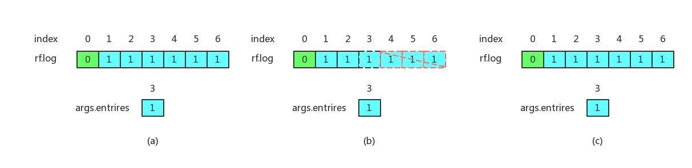
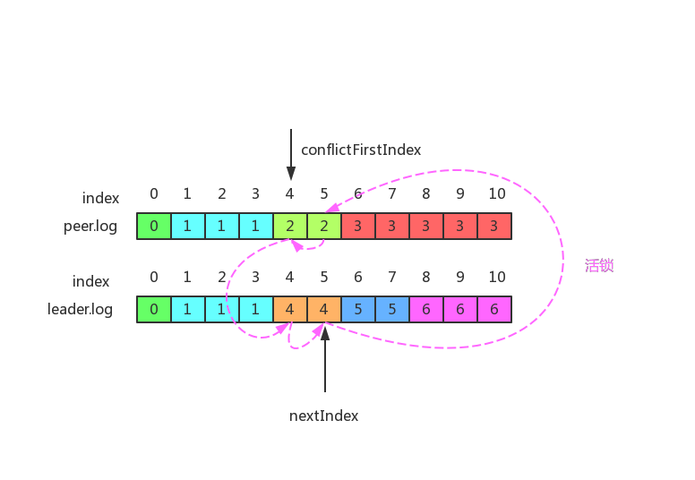
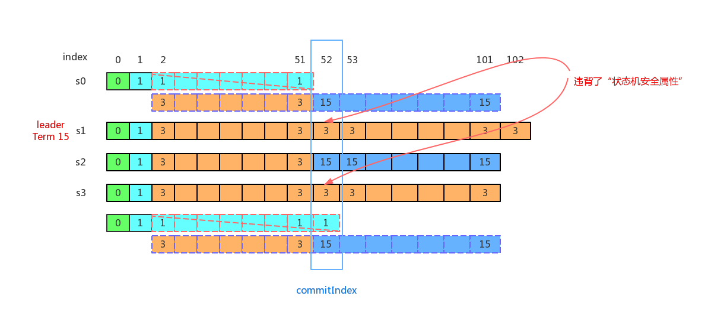

# Part 2B: Log Replication  
> 实现领导者和跟随者代码来追加新的日志条目。这将涉及到实现`Start()`，完成AppendEntries RPC结构，发送它们，充实(fleshing out)AppendEntry RPC处理程序(handler)，以及推进(advancing)领导者的`commitIndex`。    

## 1. `Start()`实现     
使用Raft的服务调用`Start()`想要就追加到Raft的log中下一条命令开始达成一致(start agreement)。如果该服务器不是leader，它返回false，否则开始达成一致并立即返回。不保证这条命令将被提交到(be committed to)Raft的log，由于leader可能故障或者输掉选举。即使Raft实例已经被杀掉，该函数也应该优雅地返回。    
由于`Start()`的功能是将接收到的客户端命令追加到自己的本地log，然后给其他所有peers并行发送AppendEntries RPC来迫使其他peer也同意领导者日志的内容，在收到大多数peers的已追加该命令到log的肯定回复后，若该entry的任期等于leader的当前任期，则leader将该entry标记为已提交的(committed)，提升(adavance)`commitIndex`到该entry所在的`index`，并发送`ApplyMsg`消息到`ApplyCh`，相当于应用该entry的命令到状态机。    
可见，`Start()`的结构与`startElection()`的结构类似，都是并行发送RPC，和与发起选举相同的是，`Start()`要根据RPC的回复来统计已追加该entry到本地log的peer的数目，在达到大多数后，提升`commitIndex`，应用该entry的命令到状态机。同时，和发起选举是单次行为不同，`Start()`可能面临客户端的并发请求，所以`Start()`必须进行更精细的处理来应对这种并发的情况。  
### 1.1 并发处理    
回顾[lab 2A中startElection()的结构](../Part%202A/readme.md#2-并行发送RPC结构)，可以看到在为每个peer封装RPC请求参数时，直接调用`len(rf.log)`来获取日志长度。但这种做法在`Start()`是危险的，考虑这样一种场景：比如客户端连续调用`Star()`三次，提交了三条命令，它们在log中编号分别为`indexN`,`indexN+1`,`indexN+2`。如果首先执行给其他peers发送AppendEntries RPC，并等待并行发送RPC结束的goroutine是`indexN+2`的，而后才执行`indexN`的，那么对于`indexN`的goroutine来说，直接调用`len(rf.log)`得到的日志长度将不是`N`而是错误的`N+2`，这就是并发情况下需要处理的细节问题。    
对于并发，`Start()`要处理的细节的细节有两个：   
1. 主要就是本次提交的命令所在entry的`index`的值。要保证在填充要复制的entries时的结尾索引必须是本次的`index`值，而不是其他并发提交的。同时在确认已将该entry复制到大多数peers后，在将`commitIndex`提升到`index`时，也必须是本次提交的`index`。    
2. 在提升`commitIndex`之前，一定要保证要提升的值`index`大于当前的`commitIndex`，并且该index的任期为当前任期，否则会造成混乱。比如`index=3`的AppendEntries RPC先到达且最终通过了一致性检查，所以提升`commitIndex=3`；随后`index=1`的AppendEntries RPC到达，自然一致性检查一次就直接通过，此时`index(1)<commitIndex(3)`，不应该提升`commitIndex`为1，这就违背了状态机安全属性。   
### 1.2  nextIndex的理解    
正如[Raft学生指南](https://thesquareplanet.com/blog/students-guide-to-raft/)指出的：    
> `nextIndex`是关于领导者和给定跟随者共享的前缀(what prefix)的一种猜测(guess)。它通常相当乐观(optimistic)(我们分享所有内容)，并且仅在负面回复(negative)时才向后移动(moved backwards)。例如，当刚刚选出一个领导者时(when a leader has just been elected)，`nextIndex`被设置为日志末尾的索引的索引(index index at the end of the log)。在某种程度上(in a way)，`nextIndex`用于性能——你只需要将这些内容发送给这个对等点。  
    
`Start()`和`broadcastHeartbeat()`都要发送AppendEntries RPC，而`AppendEntriesArgs`参数的`prevLogIndex`等于leader为该peer保存的`nextIndex`的值减1，但对于两者来说，`nextIndex`值的来源确不一样。  
对于`broadbastHeartbeat()`而言，由于心跳是周期性的常规行为，所以peer:i的`nextIndex`应该取自leader的`rf.nextIndex[i]`。而对于`Start()`来说，由于将新命令追加到了log，所以对于其他所有peers来说，其对应的`nextIndex`都应该更新为当前的log的尾后位置，即`index + 1`。      
### 1.3 达到多数者条件时必须仍处于指定状态  
对于`startElection()`，只有为`Candidate`状态且获得大多数投票，才能变为leader。      
对于`Start()`，只有为`Leader`状态且已将entry复制到了大多数peers，才能提升`commitIndex`。    
因为是为每个peer创建一个goroutine发送RPC并进行RPC回复的处理，根据回复实时统计得到肯定回复的数量。可能出现在给其中一个peer发送RPC时，因为该peer的任期比leader更高，它拒绝了candidate或leder的RPC请求，candidate或leader被拒绝后，切换到`Follower`状态。而与此同时，或者在此之后，该过时的candidaet或leader(已经切换到follwer)，收到了其他peers的大多数的肯定回复，如果这时不对candidate或leader的状态加以判断，那么该过时的candidate或leader因为满足了多数者条件，采取进一步的动作(对于过时的candidate是变为leader，对于过时的leader来说是提升`commitIndex`)，这显然是错误的！所以必须在达到多数者条件时检查下是否仍处于指定状态，如果是，才能进一步执行相关动作。   
## 1.4 当entry被提交后发送一次心跳以通知其他peers更新`commitIndex`      
在实现Part 2B的过程中，我发现在某些测试点，明明所有的peers的log都已经和leader的完全一致，但是就是无法通过测试点，查看原因便发现是因为尽管leader在收到大多数AppendEntries RPC的肯定答复后，将已提交的entries应用到了状态机，但有的peer在收到并肯定leader发来的AppendEntries RPC时，由于此时该RPC在发送时还没有得到大多数peers的肯定，所以其`leaderCommit`参数位于该entry之前，而后当该entry被leader标记为已提交并应该到自己的状态机后，由于没有发送心跳也没有再次发送AppendEntries RPC，所以该peer始终不知掉这条entry已经被提交了，尽管这条entry已经被复制到了该peer的log中，它无法应用该entry到自己的状态机，从而无法通过测试点。   
由此可见，必须要得有一种沟通机制来通知其他peers更新`commitIndex`，我的做法是在检测到所有的peers已经同意了某条entry后，就发送一次心跳，以通知所有的peers应用该entry到自己的状态机。  
## 2. AppendEntries RPC请求处理     
### 2.1 一致性检查通过后只有存在冲突才进行日志替换 
AppendEntries RPC请求处理的一个重要内容就是进行一致性检查，如果一致性检查失败，就会将`AppenEntriesReply`中的参数`success`置为false，以便leader递减`nextIndex`并重试。最终一致性检查通过，如果存在冲突的条目，则会删除冲突的条目并替换为`AppendEntriesArgs`中的`entries`。   
正如[Raft学生指南](https://thesquareplanet.com/blog/students-guide-to-raft/)指出的：    
> 许多人的另一个问题(通常在解决了上面那个问题后马上遇到)是当收到心跳后，它们会在`prevLogIndex`之后(following prevLogIndex)截断(truncate)跟随者的日志，然后追加`AppendEntries`参数中包含的任何条目。这也是不正确的。我们可以再次转向图2：    
**I**f an existing entry conflicts with a new one(same index but different terms), delete the existing entry and all that follow it.    
这里的**If**至关重要。如果跟随者拥有领导者发送的所有条目，则跟随者一定不能(MUST NOT)截断其日志。领导者发送的条目之后的任何内容(any elements following the entries sent by the leader)必须(MUST)保留。   
这是因为我们可能从领导者那里收到过时的(outdated)AppendEntries RPC，截断日志意味着“收回(taking back)”这些我们可能已经告诉领导者它们在我们的日志中的条目。    

所以判断folower日志是否和leader的log存在冲突的方法就是检查`AppendEntriesArgs`的`entries`参数中包含的条目是否都已经存在于follower的log中，如果都存在，则不存在冲突。     
可以从并发的调用`Start()`的场景下理解这个问题，比如初始时leader的log日志为空(我们的实现里空的log为含有一条index为0的包含了一条空命令的任期为0的entry的log)，客户端连续调用`Start()`6次，追加了6条命令到leader的日志中，它们的`index`分别为1-6。首先，复制`index6`的goroutine先执行，并已经将index为1-6的条目复制到某个peer的log中。而后，复制`index3`的goroutine向该peer发送AppendEntries RPC，自然一次性就通过了一致性检查，此时的场景如下图(a)所示：      
   
此时`AppendEntriesArgs`中的`entires`的所有条目在该peer的log中都存在，所以此时不存在冲突，该peer不应该截断其日志，并复制`entries`中的条目，错误的做法如图(b)所示。正确的做法是什么也无需做，如图(c)所示。    
### 2.2 减少被拒绝的AppendEntries RPC的次数     
正如[extended Raft](https://raft.github.io/raft.pdf)指出的：    
> 如果需要的话，算法可以通过减少被拒绝的追加条目(AppendEntries) RPC的次数来优化。例如，当追加条目(AppendEntries) RPC的请求被拒绝时，跟随者可以包含冲突条目的任期号和它自己存储的那个任期的第一个索引值。借助这个信息，领导者可以减少nextIndex来越过该任期内的所有冲突的日志条目；这样就变为每个任期需要一条追加条目(AppendEntries) RPC而不是每个条目一条。      

这么做之所以有效的原因在于`AppendEntriesArgs`的`entrires`携带的日志条目可以在冲突点之前，但不能在冲突点之后。也就是说，如果任期2的某个条目是冲突点，但该条目不是任期2的第一个条目，按照论文中给出的优化处理，`entries`中将包含从任期2的第一个条目到该冲突点之前的所有条目，而这些条目本身是和leader的log中对应位置的条目是匹配的，但是截断这些条目并替换为leader中一样的条目，仍然是正确的。    
而对于leader的AppendEntries RPC回复处理来说，得到了`AppendEntriesReply`的`conflictTerm`和`conflictFirstIndex`参数，需要进行进一步的处理。    
首先，`conflictFirstIndex`一定小于`nextIndex`，因为一致性检查是从`prevLogIndex(nextIndex-1)`处查看的，所以`conflictTerm`至多是`prevLogIndex`对应entry的任期，而`conflictFirstIndex`作为`conflictTerm`的第一次出现的索引，至多等于`prevLogIndex`，所以必然小于`nextIndex`。      
接着判断leader的log中`conflictFirstIndex`处entry的任期是否等于`conflictTerm`，如果等于，说明在该索引处，leader与该peer的日志已经是匹配的，可以直接将`nextIndex`置为`conflictFirstIndex+1`，否则leader应该也采取上面的优化手段，递减`conflictFirstIndex`，直到其为该任期的第一个条目的索引，接着也是将`nextIndex`置为`conflictIndex+1`，再次发送AppendEntries RPC进行重试。并且前一种情况下，接下来的这次重置将通过一致性检查，而第二种情况则不一定，而且还有可能出现“活锁”。    
考虑下面这种情况，leader的log中`conflictFirstIndex`处entry的任期和`conflictTerm`不等，而且该entry也是leader的log中该任期的第一次出现的entry。如果采取上面的方式，则进行重试时`nextIndex`就是本次`AppendEntriesReply`中的`conflictFirstIndex+1`，即接下来的`AppendEntriesArgs`中的`prevLogIndex`参数等于本次回复中的`conflictFirstIndex`，所以重试肯定无法通过一致性检查，而这次重试的回复中包含的仍是相同的`conflictFirstIndex`，这个过程就会一直重复下去，形成“活锁”。应该对这种情况进行判断，可以看出当经过上述处理的`conflictFirstIndex`的值仍和`reply.ConflictFirstIndex`相等，而且leader的`log[conflictFirstIndex].Term`又不等于`reply.ConflictTerm`时，就对应这种情况。这时只需要简单的将`nextIndex`减1，和没有优化前的处理一样，保证`nextIndex`可以前进即可。一种可能的情况如下图所示：  
     
### 2.3 一致性检查通过一定要设置为`Follower`状态    
如果收到AppendEntries RPC且一致性检查通过，必须将该peer的状态设置为`Follower`，因为收到并通过了AppendEntries RPC(包括心跳)，说明承认了leader的合法地位，此时该peer必须是follwer，而不能是candidate或leader。    
## 3. 心跳处理      
### 3.1 心跳也需要重试机制      
`Start()`中在发送AppendEntries RPC时，该RPC可能会因为一致性检查不通过而失败，此时需要递减`nextIndex`并重新发送RPC，直到一致性检查通过，然后进行进一步处理。因为发送心跳也会进行一致性检查，为了不因为初始时的日志不一致而使得心跳发送失败，而其他peers因为没有通过心跳而心跳超时(也就是选举超时，即`electionTimeout`)，进而发起不需要的(no-needed)选举，所以发送心跳也需要在一致性检查失败后进行重试。  
### 3.2 心跳应该根据`nextIndex`的值判断是否需要携带entries信息  
概念上讲，心跳不携带entries，这指的是对某个peer而言，其`nextIndex`为其log的尾后位置时的这种一般情况。但是如果`nextIndex`小于log的尾后位置，这时心跳必须携带entries，这是因为正如[1.4 当entry被提交后发送一次心跳以通知其他peers更新`commitIndex`](#14-当entry被提交后发送一次心跳以通知其他peers更新commitIndex)所述，心跳的一个作用是通知其他peer更新`commitIndex`以应用新提交的entry，所以如果这次心跳通过了一致性检查，就可能会提升`commitIndex`，这时会给`applyCond`条件变量发信号以提交`[lastApplied, commitIndex]`之间的entries。如果此次心跳没有携带entries，则不会有不一致日志的截断和leader对应位置entries的追加，所以这时提交的可能是和leader不一致的过时的entries，这就出现了严重错误。所以这种情况下心跳要携带entries信息。而是否携带entries，完全取决于`nextIndex`的值。   
在实验中，我为了保证心跳不携带entries不出现上述错误，在`Start()`调用中，当在处理AppendEntries RPC的回复时发现leader任期是过时的，除了更新leader的任期为回复中的更新的任期，切换为follower，重置`voteFor`为-1，以及重置选举超时定时器这些常规操作外，任期过时，也说明了要追加的entry是过时的，此时应该从log中删除这条entry，以免该过时的leader再次当选后，可能会复制该entry到其他peers。同时在发送心跳时，当一致性检查失败时，接下来的重试都携带entreis，以便如果这次重试的一致性检查通过，可以进行日志追加，以使得AppendEntries RPC请求处理程序提升`commitIndex`并应用新提交的entires到状态机的操作，不是应用之前不一致的entries，而是追加的leader的entries。但这还是无法避免一些情况下仍出错，比如Part 2B的测试函数`TestBackup2B()`的情况，如下图所示：    
     
## 4. 新增的长期运行的(long-runing)的应用日志条目goroutine  
一旦更新了`commitIndex`，需要一种机制将新提交的entry封装为`ApplyMsg`消息并发送到传递给`Make()`函数的参数`applyCh`channel中。    
正如[Raft Structrue Advice](https://pdos.csail.mit.edu/6.824/labs/raft-structure.txt)关于应用提交的日志条目的建议：     
> 你会想有一个单独的(separate)长期运行的goroutine来按顺序(in order)发送已提交的(committed)日志条目到`applyCh`。它必须是单独的(separate)，因为在`applyCh`上发送消息可能阻塞(block)；并且它也必须是单个的goroutine，因为否则可能很难确保你可以按照日志顺序(in log order)发送日志条目。提升(advances)`commitIndex`的代码需要踢(kick)该应用goroutine(the apply goroutine)；使用条件变量(condition variable)(Go's sync.Cond)做这个可能是最简单的。   
    
参照之前[选举超时(心跳超时)检测electionTimeoutTick的实现](../Part%202A/readme.md#12-时间驱动的time-driven长期运行的long-running的goroutine)，我们自然想到可以将该通知机制作为另一个长期运行的goroutine，它循环检测`commitIndex`是否大于`lastApplied`，如果满足，则逐个将`[lastApplied+1, commitIndex]`之间的entry封装为`ApplyMsg`发送到`applyCh`，如果不满足，则休眠等待条件变量`applyCond`而每当leader或其他follower的`commitIndex`更新后，就给`applyCond`发信号。     
`applyEntries`goroutine的代码实现如下：     
```go
// 按顺序(in order)发送已提交的(committed)日志条目到applyCh的goroutine。
// 该goroutine是单独的(separate)、长期运行的(long-running)，在没有新提交
// 的entries时会等待条件变量；当更新了commitIndex之后会给条件变量发信号，
// 以唤醒该goroutine执行提交。
func (rf *Raft) applyEntries() {
    for {

        rf.mu.Lock()
        commitIndex := rf.commitIndex
        lastApplied := rf.lastApplied
        DPrintf("[applyEntries]: Id %d Term %d State %s\t||\tlastApplied %d and commitIndex %d\n",
            rf.me, rf.currentTerm, state2name(rf.state), lastApplied, commitIndex)
        rf.mu.Unlock()

        if lastApplied == commitIndex {
            rf.mu.Lock()
            rf.applyCond.Wait()
            rf.mu.Unlock()
        } else {
            for i := lastApplied+1; i <= commitIndex; i++ {

                rf.mu.Lock()
                applyMsg := ApplyMsg{CommandValid:true, Command:rf.log[i].Command,
                    CommandIndex:i}
                rf.lastApplied = i
                DPrintf("[applyEntries]: Id %d Term %d State %s\t||\tapply command of index %d to applyCh\n",
                    rf.me, rf.currentTerm, state2name(rf.state), i)
                rf.mu.Unlock()
                rf.applyCh <- applyMsg

            }
        }
    }
}
```