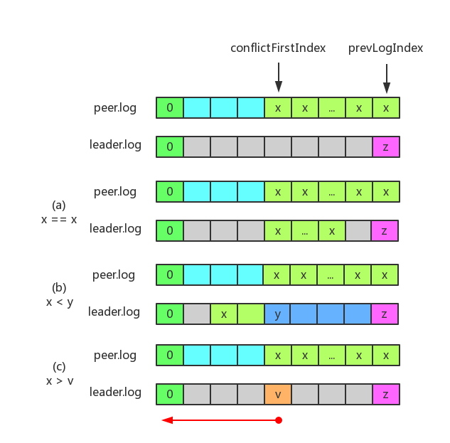

# Part 2C: Persistence      
> 如果一个基于Raft(Raft-based)的服务器重新启动，它应该从停止的地方(when it left off)恢复(resume)服务。这要求Raft保持在重启后仍然存在的(that survives a reboot)持久状态(persistent state)。论文图2提到了哪些状态(which state)应该是持久的，并且raft.go包含了如何保存(save)和恢复(restore)持久状态的示例。    
通过添加保存和恢复持久状态的代码，来完成raft.go中`persist()`和`readPersist()`函数。     
现在你需要确定(determine)在Raft协议中的哪些点(what points in the Raft protocol)你的服务器被要求持久化其状态，并在这些地方插入对`persist()`的调用。在`Raft.Make()`中已经有对`readPersist()`的调用。      

- [1. 加速的日志回溯优化(The accelerated log backtracking optimization)](#1-加速的日志回溯优化the-accelerated-log-backtracking-optimization)   
- [2. 统一广播心跳和一般AppendEntires RPC的处理](#2-统一广播心跳和一般appendentries-rpc的处理)      
- [3. 收到AppendEntires RPC后不能重置voteFor](#3-收到appendentries-rpc后不能重置votefor)    

## 1. 加速的日志回溯优化(The accelerated log backtracking optimization)     
正如[Raft学生指南](https://thesquareplanet.com/blog/students-guide-to-raft/)中的顺便提一下优化(An aside on optimizations)所述：     
> Raft论文包含了几个(a couple of)有趣的可选特性(optional features)。在6.824，我们要求学生实现其中两个：日志压缩(log compaction)(第7节)和加速的(accelerated)日志回溯(backtracking)(第8页的左上角)。前者(The former)对于避免日志无限制增长(growing without bound)是必要的(necessary)，而后者(the latter)对于使(bringing)陈旧的(stale)跟随者快速更新(up to date quickly)是有用的。     
加速的日志回溯优化是非常不明确的(underspecified)，可能因为作者认为它不是大多数部署所必须的(do not see it as being necessary for most deployments)。从文本中不清楚领导者应该如何利用从客户端发回的(sent back from client)冲突的(conflicting)索引(index)和任期(term)来确定(determine)要使用的`nextIndex`(to determine what nextIndex to use)。我们认为(believe)作者**可能(probobly)**希望你遵循的协议(protocol)是：   
如果跟随者的日志中没有`prevLogIndex`，它应该以`conflictIndex = len(log)`以及`conflictTerm = None`返回。     
如果跟随者的日志中确实有(does have)`prevLogIndex`，但该任期不匹配，它应该返回`conflictTerm = log[prevLogIndex].Term`，然后在其日志中搜索其任期等于`conflictTerm`的条目的第一个索引。    
收到冲突的响应后(Upon receiving a conflict response)，领导者应该首先(first)在其日志中搜索`conflictTerm`。如果它在日志中找到了一个具有该任期的条目，它应该将`nextIndex`设置为超出(beyond)日志中该任期的**最后一个(last)**条目的索引。    
如果它没有找到具有那个任期的条目，它应该设置`nextIndex = conflictIndex`。   
一个折中的(half-way)解决方案是只使用`conflictIndex`(而忽略`conflictTerm`)，这简化了(simplifies)实现，但是有时候领导者会向跟随者发送更多的日志条目，而不是使它们快速更新确切(strictly)需要的条目。       

[Part 2B: Log Replication的2.2 减少被拒绝的AppendEntries RPC的次数](../Part%202B/readme.md#22-减少被拒绝的appendentries-rpc的次数)，我们自己提出了一种优化策略，相对于上面给出的策略而言，我们的方案比上面给出的只使用`conflictIndex`的折中的方案，还会使领导者向跟随者发送更多的日志条目，因为我们的方案在收到冲突的回复时，会检查`reply.conflictFirstIndex`处entry的任期是否等于`reply.conflictTerm`，如果不等，leader也会采用类似的优化手段，递减`conflictFirstIndex`，直到其为该任期的第一个索引，设置`nextIndex = conflictIndex + 1`；而上面的折中的方法此时会设置`nextIndex = conflictIndex`，这样做得到的`nextIndex`肯定比我们方案得到的更靠后，而且也不会存在“活锁”问题。   
但是，我们给出的优化方案中关于`reply.conflictIndex`(也就是我们方案中的`reply.conflictFirstIndex`)的大小分析是完全正确的：   
> **`conflictFirstIndex`一定小于`nextIndex`**。因为一致性检查是从`prevLogIndex(nextIndex-1)`处查看的，所以`conflictTerm`**至多是**`prevLogIndex`对应entry的任期，而`conflictFirstIndex`作为`conflictTerm`的第一个出现的索引，**至多等于**`prevLogIndex`，所以必然小于`nextIndex`。      

接下来分析如何实现上面给出的[Raft学生指南](https://thesquareplanet.com/blog/students-guide-to-raft/)给出的优化策略：    
首先，如果跟随者的日志中没有`prevLogIndex`，也就是说`reply.conflictTerm = None`，则领导者肯定无法从其日志中搜索到该任期，所以直接设置`nextIndex = conflictIndex`。否则，分为两步：  
1. leader搜索其log检查是否具有`conflictTerm`的entry。   
2. 如果有，则继续搜索其log，以找到任期为`conflictTerm`的最后一个entry。     

其中，在第1步搜索是否具有`conflictTerm`的entry时，因为`conflictFirstIndex`小于`nextIndex`，所以可以直接从`conflictFirstIndex`处开始往前，在`[0, conflictFirstIndex]`的范围内查找是否具有`conflictTerm`的entry。这是一般做法。也可以根据`reply.conflictTerm`和`log[reply.conflictFirstIndex].Term`的大小关系，做进一步的细化分析：   
       
如图所示，灰色部分表示未知任期的entries。   
1. `reply.conflictTerm = log[reply.conflictFirstIndex].Term`   
如(a)所示，这时步骤1可以确定存在具有`conflictTerm`的条目，步骤2从`reply.conflictFirstIndex`处向前搜索，直到抵达`nextIndex`之前。     
2. `reply.conflictTerm < log[reply.conflictFristIndex].Term`    
如(b)所示，这时步骤1可能存在具有`conflictTerm`的条目，如果存在，则发现点即步骤2的搜索结果，即任期为`conflictTerm`的最后一个entry。      
3. `reply.conflictTerm > log[reply.conflictFirstIndex].Term`    
如(c)所示，这时步骤1无法找到具有`conflictTerm`的条目。因为搜索是从`reply.conflictFirstIndex`处往前的，并且日志条目的任期是非降序的，所以leader的log中从`[0, conflictFirstIndex]`之间不存在任期等于`conflictTerm`的entry。       

代码实现如下：  
```go
func (rf *Raft) getNextIndex(reply AppendEntriesReply, nextIndex int) int {
    // 这里递减nextIndex使用了论文中提到的优化策略：
    // If desired, the protocol can be optimized to reduce the number of rejected AppendEntries
    // RPCs. For example,  when rejecting an AppendEntries request, the follower can include the
    // term of the conflicting entry and the first index it stores for that term. With this
    // information, the leader can decrement nextIndx to bypass all of the conflicting entries
    // in that term; one AppendEntries RPC will be required for each term with conflicting entries,
    // rather than one RPC per entry.
    // 只存在reply.ConflictFirstIndex < nextIndex，由于一致性检查是从nextIndex-1(prevLogIndex)处
    // 查看的，所以不会出现reply.ConflictFirstIndex >= nextIndex。

    // reply's conflictTerm=0，表示None。说明peer:i的log长度小于nextIndex。
    if reply.ConflictTerm == 0 {
        // If it does not find an entry with that term, it should set nextIndex = conflictIndex
        nextIndex = reply.ConflictFirstIndex
    } else {	// peer:i的prevLogIndex处的任期与leader不等
        // leader搜索它的log确认是否存在等于该任期的entry
        conflictIndex := reply.ConflictFirstIndex
        conflictTerm := rf.Log[conflictIndex].Term
        // 只有conflictTerm大于或等于reply's conflictTerm，才有可能或一定找得到任期相等的entry
        if conflictTerm >= reply.ConflictTerm {
            // 从reply.ConflictFirstIndex处开始向搜索，寻找任期相等的entry
            for i := conflictIndex; i > 0; i-- {
                if rf.Log[i].Term == reply.ConflictTerm {
                    break
                }
                conflictIndex -= 1
            }
            // conflictIndex不为0，leader的log中存在同任期的entry
            if conflictIndex != 0 {
                // 向后搜索，使得conflictIndex为最后一个任期等于reply.ConflictTerm的entry
                for i := conflictIndex+1; i < nextIndex; i++ {
                    if rf.Log[i].Term != reply.ConflictTerm {
                        break
                    }
                    conflictIndex += 1
                }
                nextIndex = conflictIndex + 1
            } else {	// conflictIndex等于0，说明不存在同任期的entry
                nextIndex = reply.ConflictFirstIndex
            }
        } else {	// conflictTerm < reply.ConflictTerm，并且必须往前搜索，所以一定找不到任期相等的entry
            nextIndex = reply.ConflictFirstIndex
        }

    }
    return nextIndex
}
```

## 2. 统一广播心跳和一般AppendEntries RPC的处理     
在[Part 2B: Log Replication的1.2 nextIndex的理解](../Part%202B/readme.md/#12-nextindex的理解)，我们曾指出：  
> 对于`broadcastHeartbeat()`而言，由于心跳是周期性的常规行为，所以peer:i的`nextIndex`应该取自leader的`rf.nextIndex[i]`。而对于`Start()`来说，由于将新命令追加到了log，所以对于其他所有peers来说，其对应的`nextIndex`都应该更新为当前的log的尾后位置，即`index+1`。      

这里存在一个问题：对于`Start()`而言，客户端新提交的命令被追加到leader的本地log后，要发送AppendEntries RPC以复制该entry到其他所有peers，如果此时将`nextIndex`设置为`index+1`，那么这次的一致性检查一定是失败的，因为当前除了leader的log具有该entry外，其他所有peers的log都还没有该entry。然后就等着递减`nextIndex`，直到达到某个点，peer:i与leader的日志达到一致，所以**接受新命令后就设置`nextIndex = index + 1`，会导致额外的没有必要的一致性检查失败与重试，显然存在问题**。而如果直接和心跳一样，对于peer:i直接沿用当前的`rf.nextIndex[i]`，也不会存在问题，反而减少了原来方案不必要的一致性检查失败的次数。     
在`broadcastHeartbeat()`某个版本的实现中，我模仿`Start()`的并发处理，在为peer:i发送RPC的gorotuine中，我将`nextIndex`作为参数传递给该goroutine，当一致性检查失败后，递减该参数的值，而不是leader为该peer保留的`nextIndex`的值，即`rf.nextIndex[i]`，只有当最终收到该peer的肯定答复后，才更新`rf.nextIndex[i]`的值。这种做法存在问题：发送心跳时，应该直接采用leader当前的nextIndex，而不采用创建goroutine时的nextIndex。这是因为发送心跳可能因为一致性检查而失败，这时需要递减nextIndex以重试，此时被递减后的nextIndex应该立即反馈到leader为该peer保存的nextIndex上。因为在Part 2C的Figure 8(unreliable)测试中，我发现本次广播心跳时，因为peer:i和leader的差距太大，而导致一致性检查在整个心跳发送期间都没有通过。接着下一次心跳到来，如果没有在一致性检查失败后实时更新leader为peer:i保存的`rf.nextIndex[i]`，那么这次的心跳仍会使用和前一次一直是失败的心跳初始时相同的nextIndex，这样会明显减少peer:i与leader日志达成一致的速度，从而导致该测试点失败。存在问题的该版本代码的整体结构如下：     
```go
func (rf *Raft) broadcastHeartbeat() {
    go func(term int, commitIndex int, lenOfLog int) {
        for i, _ := range rf.peers {
            if i == rf.me {
                continue
            }
            go func(i int, rf *Raft, nextIndex int) {
            retry:
                prevLogIndex := nextIndex - 1
                if reply.Success == false {
                    if rf.CurrentTerm >= reply.Term {
                        // 一致性检查失败
                        nextIndex -= 1
                    }
                } else {
                    // 心跳发送成功
                    if rf.nextIndex[i] < lenOfLog {
                        rf.nextIndex[i] = lenOfLog
                        rf.matchIndex[i] = lenOfLog - 1
                    }
                }
            } (i, rf, rf.nextIndex[i])
        }
    } (rf.CurrentTerm, rf.commitIndex, len(rf.log))
}
```

在[Part 2B: Log Replication的1.4 当entry被提交后发送一次心跳以通知其他peers更新`commitIndex`](../Part%202B/readme.md/#14-当entry被提交后发送一次心跳以通知其他peers更新commitindex)，我们在新追加的entry被标记为committed之后，发送一次心跳通知其他所有的peers应用该entry，其实对于心跳也可以采用相同的处理，这并不会造成问题。     
最终，我们发现其实可以统一广播心跳和`Start()`广播AppendEntries RPC的代码，最终统一为广播AppendEntires RPC：    
```go
// 并行给其他所有peers发送AppendEntries RPC(包括心跳)，在每个发送goroutine中实时统计
// 已发送RPC成功的个数，当达到多数者条件时，提升commitIndex到index，并通过一次心跳
// 通知其他所有peers提升自己的commitIndex。
func (rf *Raft) broadcastAppendEntries(index int, term int, commitIndex int, nReplica int, name string) {
    var wg sync.WaitGroup
    majority := len(rf.peers)/2 + 1
    isAgree := false

    // 只有leader可以发送AppendEntries RPC(包括心跳)
    if _, isLeader := rf.GetState(); isLeader == false {
        return
    }

    // 为避免得到调度过迟导致任期过时，需要判断下。
    rf.mu.Lock()
    if rf.CurrentTerm != term {
        rf.mu.Unlock()
        return
    }
    rf.mu.Unlock()

    rf.mu.Lock()
    DPrintf("[%s]: Id %d Term %d State %s\t||\tcreate an goroutine for index %d term %d commitIndex %d" +
        " to issue parallel and wait\n", name, rf.me, rf.CurrentTerm, state2name(rf.state), index, term, commitIndex)
    rf.mu.Unlock()

    for i, _ := range rf.peers {

        if i == rf.me {
            continue
        }
        wg.Add(1)

        // 给peer:i发送AppendEntries(包括心跳)
        go func(i int, rf *Raft) {

            defer wg.Done()

            // 在AppendEntries RPC一致性检查失败后，递减nextIndex，重试
        retry:

            // 因为涉及到retry操作，避免过时的leader继续执行
            if _, isLeader := rf.GetState(); isLeader == false {
                return
            }

            // 避免进入新任期，还发送过时的AppendEntries RPC
            rf.mu.Lock()
            if rf.CurrentTerm != term {
                rf.mu.Unlock()
                return
            }
            rf.mu.Unlock()

            rf.mu.Lock()
            // 封装AppendEntriesArgs参数
            // 发送心跳时，直接采用leader当前的nextIndex，而不采用创建goroutine时的nextIndex。
            // 这是因为发送心跳可能因为一致性检查而失败，这时需要递减nextIndex以重试，此时被递减后的
            // nextIndex应该立即反馈到leader为该peer保存的nextIndex上。因为在Part 2C的Figure 8(unreliable)
            // 测试中，我发现本次广播心跳时，因为peer:i和leader的日志差距太大，而导致一致性检查在整个心跳发送期间
            // 都没有通过。接着下一次心跳到来，如果没有在一致性检查失败后实时更新leader为peer:i保存的rf.nextIndex[i]，
            // 那么这次新的心跳仍会使用和前一次一直是失败的心跳初始时相同的nextIndex，这样明显会减少
            // peer:i与leader日志达成一致的速度，从而导致该测试点失败。
            nextIndex := rf.nextIndex[i]
            prevLogIndex := nextIndex - 1
            if prevLogIndex < 0 {
                DPrintf("[%s]: Id %d Term %d State %s\t||\tinvalid prevLogIndex %d for index %d" +
                    " peer %d\n", name, rf.me, rf.CurrentTerm, state2name(rf.state), prevLogIndex, index, i)
            }
            prevLogTerm := rf.Log[prevLogIndex].Term
            // 不论是普通的AppendEntries RPC还是心跳，都根据nextIndex的值来决定是否携带entries
            // Todo:概念上将心跳不携带entries，这指的是当nextIndex为log的尾后位置时的一般情况。
            // 但是如果nextIndex小于log的尾后位置，这是心跳必须携带entries，因为这次心跳可能就会
            // 通过一致性检查，并可能提升commitIndex，这时会给applyCond条件变量发信号以提交
            // [lastApplied+1, commitIndex]之间的entries。如果此次心跳没有携带entries，则不会有
            // 日志追加，所以提交的可能是和leader不一致的过时的entries，这就出现了严重错误。所以
            // 这种情况下心跳要携带entries。
            entries := make([]LogEntry, 0)
            if nextIndex < index+1 {
                entries = rf.Log[nextIndex:index+1]		// [nextIndex, index+1)
            }
            if nextIndex > index+1 {
                DPrintf("[%s]: Id %d Term %d State %s\t||\tinvalid nextIndex %d while index %d\n",
                    name, rf.me, rf.CurrentTerm, state2name(rf.state), nextIndex, index)
            }
            args := AppendEntriesArgs{
                Term:term,
                LeaderId:rf.me,
                PrevLogIndex:prevLogIndex,
                PrevLogTerm:prevLogTerm,
                Entries:entries,
                LeaderCommit:commitIndex,
            }
            DPrintf("[%s]: Id %d Term %d State %s\t||\tissue AppendEntries RPC for index %d" +
                " to peer %d with nextIndex %d\n", name, rf.me, rf.CurrentTerm, state2name(rf.state), index, i, nextIndex)
            rf.mu.Unlock()
            var reply AppendEntriesReply

            // 同步发送AppendEntries RPC
            ok := rf.sendAppendEntries(i, &args, &reply)

            // 发送AppendEntries RPC失败，表明无法和peer:i建立通信，直接放弃
            if ok == false {
                rf.mu.Lock()
                DPrintf("[%s]: Id %d Term %d State %s\t||\tissue AppendEntries RPC for index %d" +
                    " to peer %d failed\n", name, rf.me, rf.CurrentTerm, state2name(rf.state), index, i)
                rf.mu.Unlock()
                return
            }

            // 图2通常不讨论当你收到旧的RPC回复(replies)时应该做什么。根据经验，
            // 我们发现到目前为止最简单的方法是首先记录该回复中的任期(the term
            // in the reply)(它可能高于你的当前任期)，然后将当前任期(current term)
            // 和你在原始RPC中发送的任期(the term you sent in your original RPC)
            // 比较。如果两者不同，请删除(drop)回复并返回。只有(only)当两个任期相同，
            // 你才应该继续处理该回复。通过一些巧妙的协议推理(protocol reasoning)，
            // 你可以在这里进一步的优化，但是这个方法似乎运行良好(work well)。并且
            // 不(not)这样做将导致一个充满鲜血、汗水、眼泪和失望的漫长而曲折的(winding)道路。
            rf.mu.Lock()
            if rf.CurrentTerm != args.Term {
                rf.mu.Unlock()
                return
            }
            rf.mu.Unlock()

            // AppendEntries RPC被拒绝，原因可能是leader任期过时，或者一致性检查未通过
            // 发送心跳也可能出现一致性检查不通过，因为一致性检查是查看leader的nextIndex之前
            // 即(prevLogIndex)的entry和指定peer的log中那个索引的日志是否匹配。即使心跳中
            // 不携带任何日志，但一致性检查仍会因为nextIndex而失败，这时需要递减nextIndex然后重试。
            if reply.Success == false {
                rf.mu.Lock()
                DPrintf("[%s]: Id %d Term %d State %s\t||\tAppendEntries RPC for index %d" +
                    " is rejected by peer %d\n", name, rf.me, rf.CurrentTerm, state2name(rf.state), index, i)
                // 如果是leader任期过时，需要切换到follower并立即退出。这里应该使用
                // args.Term和reply.Term比较，因为一致性检查就是比较的这两者。而直接
                // 使用rf.currentTerm和reply.Term比较的话，任期过时的可能性就小了。
                // 因为rf.currentTerm在同步发送RPC的过程中可能已经发生改变！
                if args.Term < reply.Term {
                    rf.CurrentTerm = reply.Term
                    rf.VoteFor = -1
                    rf.switchTo(Follower)

                    DPrintf("[%s]: Id %d Term %d State %s\t||\tAppendEntires RPC for index %d is rejected" +
                        " by peer %d due to newer peer's term %d\n", name, rf.me, rf.CurrentTerm, state2name(rf.state),
                                                                        index, i, reply.Term)

                    // 任期过时，切换为follower，更新下持久状态
                    rf.persist()

                    rf.mu.Unlock()
                    // 任期过时，直接返回
                    return
                } else {	// 一致性检查失败，则递减nextIndex，重试
                    nextIndex := rf.getNextIndex(reply, nextIndex)
                    // 更新下leader为该peer保存的nextIndex
                    rf.nextIndex[i] = nextIndex
                    DPrintf("[%s]: Id %d Term %d State %s\t||\tAppendEntries RPC for index %d is rejected by" +
                        " peer %d due to the consistency check failed\n", name, rf.me, rf.CurrentTerm, state2name(rf.state),
                                                                index, i)
                    DPrintf("[%s]: Id %d Term %d State %s\t||\treply's conflictFirstIndex %d and conflictTerm %d\n",
                                name, rf.me, rf.CurrentTerm, state2name(rf.state), reply.ConflictFirstIndex, reply.ConflictTerm)
                    DPrintf("[%s]: Id %d Term %d State %s\t||\tretry AppendEntries RPC with nextIndex %d," +
                        " so prevLogIndex %d and prevLogTerm %d\n", name, rf.me, rf.CurrentTerm, state2name(rf.state),
                                                                nextIndex, nextIndex-1, rf.Log[nextIndex-1].Term)
                    rf.mu.Unlock()
                    goto retry
                }
            } else {	// AppendEntries RPC发送成功
                rf.mu.Lock()
                DPrintf("[%s]: Id %d Term %d State %s\t||\tsend AppendEntries RPC for index %d to peer %d success\n",
                                        name, rf.me, rf.CurrentTerm, state2name(rf.state), index, i)

                // 如果当前index更大，则更新该peer对应的nextIndex和matchIndex
                if rf.nextIndex[i] < index + 1 {
                    rf.nextIndex[i] = index + 1
                    rf.matchIndex[i] = index
                }
                nReplica += 1
                DPrintf("[%s]: Id %d Term %d State %s\t||\tnReplica %d for index %d\n",
                                    name, rf.me, rf.CurrentTerm, state2name(rf.state), nReplica, index)

                // 如果已经将该entry复制到了大多数peers，接着检查index编号的这条entry的任期是否为当前任期，
                // 如果是则可以提交该条目
                if isAgree == false && rf.state == Leader && nReplica >= majority {
                    isAgree = true
                    DPrintf("[%s]: Id %d Term %d State %s\t||\thas replicated the entry with index %d" +
                        " to the majority with nReplica %d\n", name, rf.me, rf.CurrentTerm, state2name(rf.state),
                                                                index, nReplica)

                    // 如果index大于commitIndex，而且index编号的entry的任期等于当前任期，提交该entry
                    if rf.commitIndex < index && rf.Log[index].Term == rf.CurrentTerm {
                        DPrintf("[%s]: Id %d Term %d State %s\t||\tadvance the commitIndex to %d\n",
                                            name, rf.me, rf.CurrentTerm, state2name(rf.state), index)

                        // 提升commitIndex
                        rf.commitIndex = index

                        // 当该entry被提交后，可以发送一次心跳通知其他peers更新commitIndex
                        go rf.broadcastHeartbeat()
                        // 更新了commitIndex可以给applyCond条件变量发信号，以应用新提交的entry到状态机
                        rf.applyCond.Broadcast()
                        DPrintf("[%s]: Id %d Term %d State %s\t||\tapply updated commitIndex %d to applyCh\n",
                            name, rf.me, rf.CurrentTerm, state2name(rf.state), rf.commitIndex)

                    }
                }
                rf.mu.Unlock()
            }
        }(i, rf)
    }

    // 等待所有发送AppendEntries RPC的goroutine退出
    wg.Wait()
}
```

## 3. 收到AppendEntries RPC后不能重置`voteFor`       
在Figure 8(unreliable)这个测试点，我的实现有时会出现某个peer应用的命令和leader不一样，也就是说出现了违背状态机安全属性的致命错误！这个问题偶然才会出现，并且由于输出的log过长(大部分三四万行)，因此很难排查，最终经过痛苦的log排错，我发现问题出在在接收到AppendEntries RPC后，重置了`voteFor`，导致一个任期内有两个leader被选出，最终导致一致性检查在该处通过，但是对于该entry，虽然任期相同，但是含有和leader不同的命令，应用该entry到状态机，违背了状态机安全属性。      
具体情景如下：      
-1.png)    
-2.png)    
如(b)所示，`term 14`内s4为leader，接收客户端命令c1，复制到自己的log中，索引值为13；接着，s4 crash，s0恢复，s0超时发起选举。由于s0重启后的任期为crash前的任期，即`term 13`，所以s0变为candidate，其任期为14，并获得s1，s2以及自身的投票，赢得选举，成为继s4后`term 14`内的第二个leader。     
如(c)所示，s0成为leader后，接收客户端命令c2，将该命令复制到自己、s1、s2的log中的`index = 13`处，其任期也为14，但与s4的`index = 13`的entry，任期相同，含有不同的命令。   
如(f)所示，s4恢复，并在`index = 13`处通过一致性检查，由于与leader s1在此处具有相同的任期14，但两者包含的命令不同，然后s4应用此处的entry应用到自己的状态机，导致应用的命令与leader在此处应用的命令不同，违背了状态机安全属性。     
究其原因，图(c)中在`term = 14`，s4 crash，s0恢复并变为任期为14的candidate，发起选举时，任期为14的s1和s2不能再给任期为14的s0授予投票，**因为一个term至多只能有一个leader被选出**，上面这种情况显然违背了Raft算法对于任期的定义，同时也违背了选举安全属性：一个给定的任期内至多可以有一个领导者被选出。而此时s1和s2能再次为s0投票，是因为s1和s2作为follower，在收到任期为14的leader s4的AppendEntries RPC时，重置了自己的`voteFor`。显然，在收到并通过AppendEntries RPC时，不同重置`voteFor`，**`voteFor`只能在发现自己的任期过时的情况下才重置**。    
